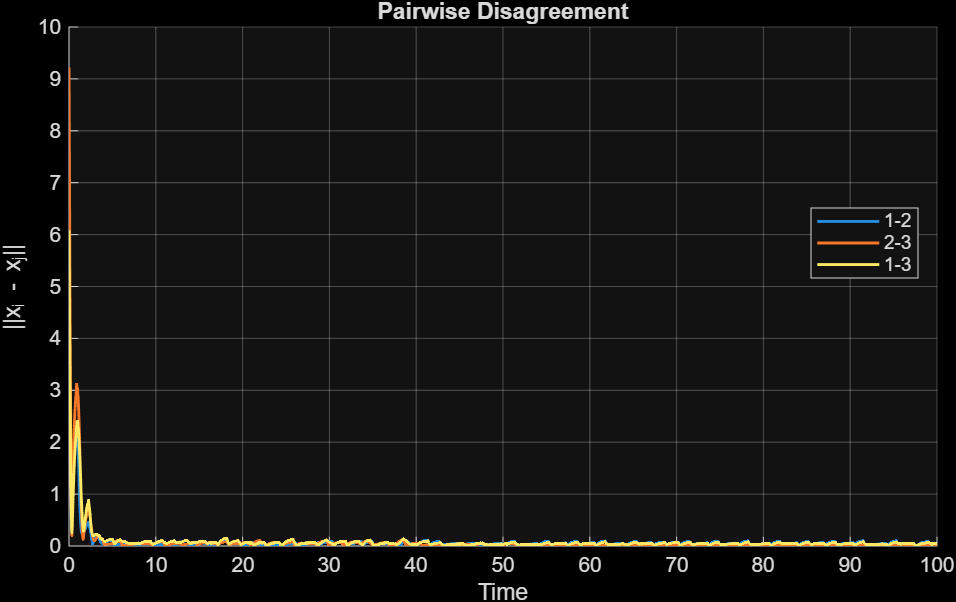

# Project notes

## Dynamical Equations (19/11/25)

The event-triggered dynamics discussed on 19/11/25 were written in agent form as:

$$
\dot{x}_i
= -\nabla f_i(x_i)
  - \sum_j a_{ij}(\hat{x}_i - \hat{x}_j)
  - \sum_j a_{ij}(\hat{z}_i - \hat{z}_j),
$$

$$
\dot{z}_i
= \sum_j a_{ij}(\hat{z}_i - \hat{z}_j).
$$

In compact Laplacian form, these were expressed as:

$$
\dot{x} = -\nabla f(x) - L\hat{x} - L\hat{z},
$$

$$
\dot{z} = L\hat{z}.
$$

After expanding the sampled values  
$\hat{x} = x + e_x,\ \ \hat{z} = z + e_z$  
  
we obtained:

$$
\dot{x} = -\nabla f(x) - Lx - Lz - L e_x - L e_z,
$$

$$
\dot{z} = Lz + L e_z.
$$

These are the equations exactly as written on the board on 19/11/25.

## Correction in Equations

It was later identified that the expression for \( \dot{z} \) was **incorrect** for the intended purpose.

The form  
$$\dot{z} = Lz + L e_z$$
does **not** act as an integral of the disagreement in \(x\).  
Because \(Lz\) is a consensus flow, this term forces \(z\) **toward agreement**, so it cannot accumulate gradient disagreement.

The correct equation should integrate **\(Lx\)** instead.  
The corrected form is:

$$
\dot{z} = Lx + L e_x.
$$

With this change, the pair of dynamics becomes:

$$
\dot{x}
= -\nabla f(x) - Lx - Lz - L e_x - L e_z,
$$

$$
\dot{z}
= Lx + L e_x.
$$

Here:

- $z$ now behaves as an **integrator of disagreement in $x$**,  
- the term $-z$ in $\dot{x}$ provides the required **integral correction**,  
- the system now structurally matches the role of $v$ in the original algorithm.

This correction restores the intended convergence behaviour.
- $z$ now behaves as an **integrator of disagreement in $x$**,  
- the term $-z$ in $\dot{x}$ provides the required **integral correction**,  
- the system now structurally matches the role of $v$ in the original algorithm.

This correction restores the intended convergence behaviour.

## Results
1. 
2. 

